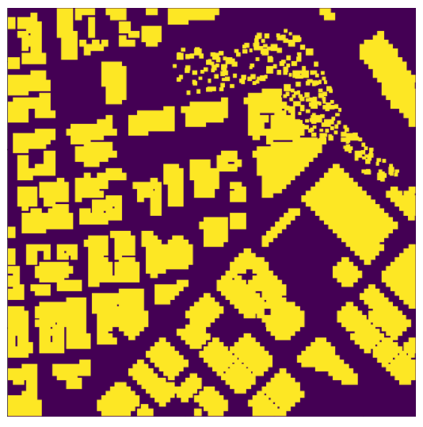
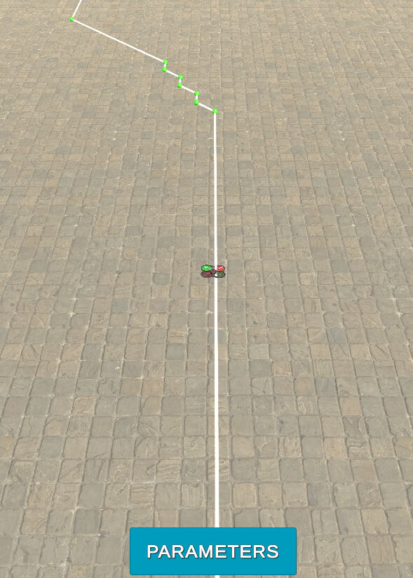

# Project: 3D Motion Planning

## Explain the Starter Code

### 1. Explain the functionality of what's provided in `motion_planning.py` and `planning_utils.py`
Inside the starter code of this project we find a various function and algorithm to compute a path for a flying drone.

#### Path Planning Function
 - `Collider.csv` loader: 
 ```
 data = np.loadtxt('colliders.csv', delimiter=',', dtype='Float64', skiprows=2)
 ```
 This part of the code is responsible for loading and parsing the data contain inside a csv file. The data format is a list of values containing the coordinate of the obstacle in the map.

 - Grid map generator:
 ```
 grid, north_offset, east_offset = create_grid(data, TARGET_ALTITUDE, SAFETY_DISTANCE)
 ```
 The `create_grid()` function generate a map of the environment. This map contain obstacle with a safety distance around the real obstacles and this map is considered at a given altitude.
 
 

 - Start and Goal definition:
```
grid_start = (-north_offset, -east_offset)
grid_goal = (-north_offset + 10, -east_offset + 10)
 ```
This code snipet show how to setup a goal and a start position inside the grid representation. With the starter code, we set it up at the north and east offset. Then the goal is set 10 meters away in each direction.

- A* search Algorithm:
```
path, path_cost = a_star(grid, heuristic, grid_start, grid_goal)
```
Once we obtain a goal a path search is launched. The Heuristic function is define as the L2 norm between the current position and the goal.

- Waypoints convertion:
Now that we have a plan inside the grid we need to convert them into waypoints for the drone to reach successively.

```
waypoints = [[p[0] + north_offset, p[1] + east_offset, TARGET_ALTITUDE, 0] for p in path]
# Set self.waypoints
self.waypoints = waypoints
```

- Send Waypoint to the drone API
The last step is to send the waypoints to the drone
```
def send_waypoints(self):
  print("Sending waypoints to simulator ...")
  data = msgpack.dumps(self.waypoints)
  self.connection._master.write(data)
```

## Implementing Your Path Planning Algorithm

### 1. Set your global home position
Here students should read the first line of the csv file, extract lat0 and lon0 as floating point values and use the self.set_home_position() method to set global home. Explain briefly how you accomplished this in your code.
```
filename = 'colliders.csv'
# Open file
with open(filename, 'r') as file:
    # Read the first line
    first_line = file.readline()
# Parse the first line to get lon0 and lat0
lon_lat = first_line.split(",")
float_lat = float(lon_lat[0].split()[1])
float_lon = float(lon_lat[1].split()[1])

# set home position to (lon0, lat0, 0)
self.global_home[0] = float_lon  
self.global_home[1] = float_lat
self.global_home[2] = 0.
```
1. open the file with the origin longitude and latitude
2. get the first line ofn the file
3. parse the line
4. set home position


### 2. Set your current local position
The code itself is self explanatory
```
current_local_position = []
current_local_position = global_to_local (self.global_position, self.global_home)
```

### 3. Set grid start position from local position
```
north_start = int(current_local_position[0])
easth_start = int(current_local_position[1])

grid_start = ( (north_start + -north_offset) , (easth_start + -east_offset) )
```

### 4. Set grid goal position from geodetic coords
```
goal_lon = -122.397745 
goal_lat =  37.793837

goal_pos_global = []
goal_pos_global = [ goal_lon , goal_lat , 0.]

goal_pos_local = []       
goal_pos_local = global_to_local(goal_pos_global,self.global_home)
  
north_goal = int(goal_pos_local[0])
easth_goal = int(goal_pos_local[1])

grid_goal = ( ( north_goal + -north_offset )  , (easth_goal + -east_offset) )
```

### 5. Modify A* to include diagonal motion (or replace A* altogether)
First we need to add the diagonal movement to the list of available action for the drone. Those modification are in the `planning_utils.py` file. 
```
NORTH_WEST = (-1, -1, np.sqrt(2))
NORTH_EAST = (-1, 1, np.sqrt(2))
SOUTH_WEST = (1, -1, np.sqrt(2))
SOUTH_EAST = (1, 1, np.sqrt(2))
```

Then we need to add a check for this action to be valid by checking a potential collision
```
if (x - 1 < 0 or y - 1 < 0) or grid[x - 1, y - 1] == 1:
    valid_actions.remove(Action.NORTH_WEST)
if (x - 1 < 0 or y + 1 > m) or grid[x - 1, y + 1] == 1:
    valid_actions.remove(Action.NORTH_EAST)
if (x + 1 > n or y - 1 < 0) or grid[x + 1, y - 1] == 1:
    valid_actions.remove(Action.SOUTH_WEST)
if (x + 1 > n or y + 1 > m) or grid[x + 1, y + 1] == 1:
    valid_actions.remove(Action.SOUTH_EAST)
```

### 6. Cull waypoints 
With the Collinearity method we remove intermediate waypoints from the path. This method check if 3 points are aligned and remove the intermediate point in case the points are aligned

It is present in the `motion_planning.py` file by calling the function `prune_path()`.
```
# prune path to minimize number of waypoints
pruned_path = prune_path(path)
```
And the function is defined in the `planning_utils.py` file

```
def prune_path(path):
  pruned_path = [p for p in path]
  
  i = 0
  while i < len(pruned_path) - 2:
      p1 = point(pruned_path[i])
      p2 = point(pruned_path[i+1])
      p3 = point(pruned_path[i+2])
      
      # If the 3 points are in a line remove
      # the 2nd point.
      # The 3rd point now becomes and 2nd point
      # and the check is redone with a new third point
      # on the next iteration.
      if collinearity_check(p1, p2, p3):
          # Something subtle here but we can mutate
          # `pruned_path` freely because the length
          # of the list is check on every iteration.
          pruned_path.remove(pruned_path[i+1])
      else:
          i += 1
      
  return pruned_path
```

To check the collinearity we use the following function:

```
def collinearity_check(p1, p2, p3, epsilon=1e-6):   
  m = np.concatenate((p1, p2, p3), 0)
  det = np.linalg.det(m)
  return abs(det) < epsilon

```

## Execution 

Here is a screenshot of an execution of the motion planning inside the simulator.

